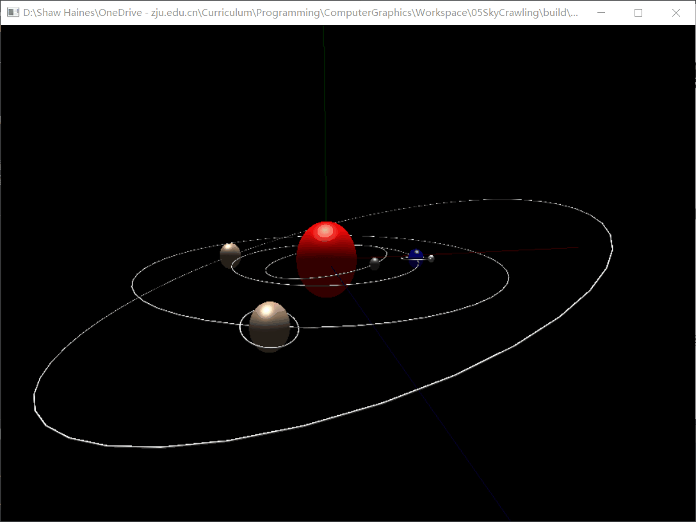
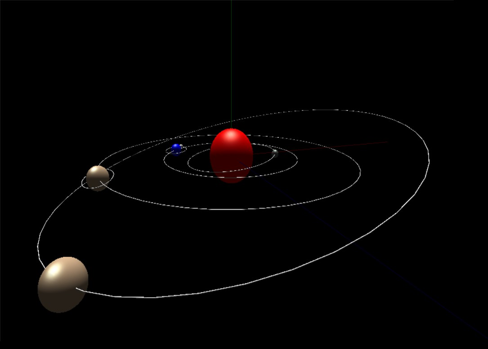
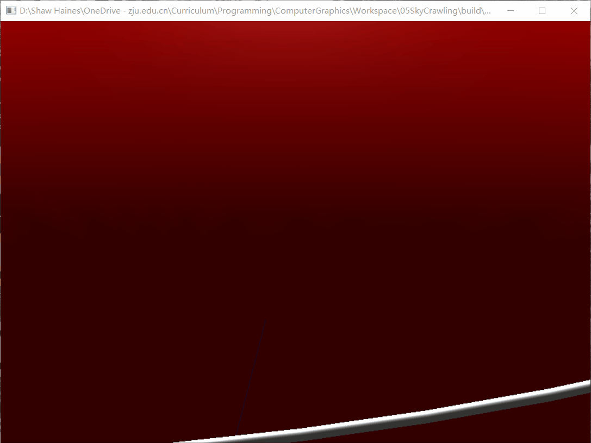
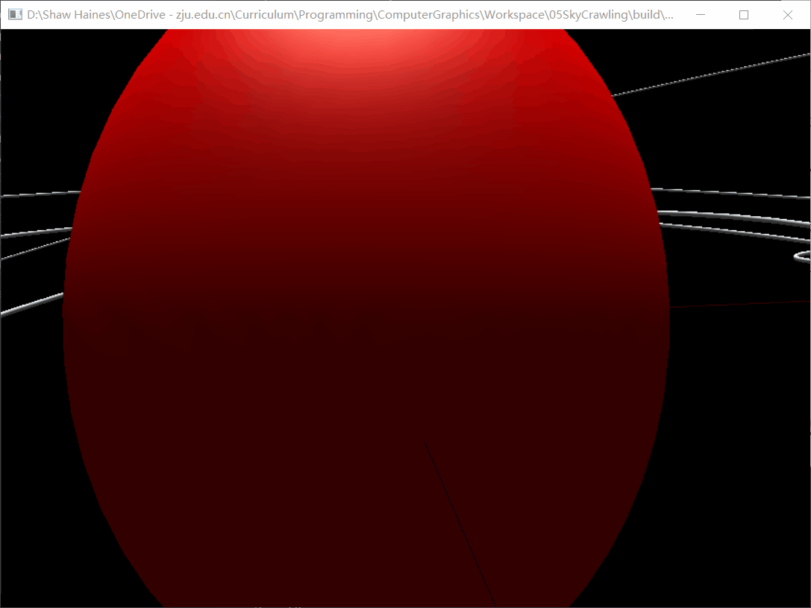

# Solar System 太阳系模型

石昊海 3180102707



## 简介

利用OpenGL的变换矩阵、投影矩阵，构造一个三维太阳系模型。

主要要求
* 至少2颗行星（围绕恒星公转）
* 至少1颗卫星（围绕行星公转）
* 各行星轨道不共面
* 可以通过键盘、鼠标进行简单的交互，达到平移、缩放等效果。

## 实现方法

### 类定义

定义`Astroid`天体类和`Orbit`轨道类，封装星体的半径`radius`、轨道半径`Orbit`、周期`period`、颜色`color`、轨道平面法向量`normal`等参数，并定义绘制`display()`、公转`revolution()`方法，实现类的封装。

```C++
class Orbit {
   public:
    Orbit(double r, double nx = 0, double ny = -1, double nz = 0);
    double radius;
    // center of the orbit.
    Point center;
    // normal vector
    Vector normal;
    int display();
    int setColor(double r, double g, double b, double a);

   private:
    GLdouble color[4];
};

class Astroid {
   public:
    Astroid(double r, double orbitR, double period = 100, double nx = 0,
            double ny = -1, double nz = 0);
    double radius;
    Orbit orbit;
    /**
     * displays the astroids in recursive manner.
     * You only have to call the sun.display().
     * */
    int display();
    // calculates revolution also in recursive manner.
    int revolution();
    int setColor(double r, double g, double b, double a);
    // list of its satellites.
    std::list<Astroid*> satellites;
    // TODO: Add rotation. For now we omit the rotation axis.
   private:
    GLdouble color[4];
    // revolution period, unit is second.
    double period;
    // the anglular position.
    double phi;
};
```

值得一提的是，这里采用了坐标系的树状结构存储不同行星之间的相对位置。从根到叶子节点为恒星、行星、卫星三层。天体的卫星即为它的叶子节点，存储在`satellites`成员中。

```C++
std::list<Astroid*> satellites;
```

定义行星、恒星、卫星的时候，只需依次指定出天体间的相对关系，在相应的天体的卫星列表中添加环绕它的行星（卫星）。

```C++
// planets
sun->satellites.push_back(earth);
sun->satellites.push_back(jupyter);
sun->satellites.push_back(mercury);
sun->satellites.push_back(saturn);
// satellites
earth->satellites.push_back(moon);
saturn->satellites.push_back(saturnRing);
```

### 场景构建

调用绘制函数`display()`利用递归的方法实现，类似树的前序遍历。
1. 运用旋转变换把原先的z轴旋转至与轨道法向量重合
2. 绘制轨道
3. 运用旋转变换使x轴指向天体的角位置
4. 平移使天体移动到原点
5. 绘制球体天体
6. 递归调用天体卫星的绘制函数
7. 弹出栈中的变换矩阵

比较重要的地方是需要及时弹出废弃的变换矩阵，确保当前矩阵CTM在处理天体的兄弟节点时不受影响。

```C++
int Astroid::display() {
    // Assuming that the MODEL matrix has already been set to the center.
    glMatrixMode(GL_MODELVIEW);
    // get the plane by rotating according to a cross product.
    Vector upVector(0, -1, 0);
    auto axis = cross(upVector, orbit.normal);
    axis.normalize();
    glPushMatrix();
    if (!axis.isZero()) {
        double angle = degrees(acos(orbit.normal.dot(upVector)));
        glRotated(angle, axis.end[0], axis.end[1], axis.end[2]);
    }
    orbit.display();
    // the angle is defined in degrees...
    glRotated(degrees(phi), 0, -1, 0);
    glTranslated(orbit.radius, 0, 0);
    glColor3dv(color);
    glutSolidSphere(radius, slices, slices);
    for (auto i = satellites.begin(); i != satellites.end(); i++) {
        (*i)->display();
    }
    glPopMatrix();
    return 0;
}
```

按照此方法，只要设置好根节点，也就是太阳的位置，即可根据预先定义好的相对位置画出整个太阳系中的天体。

### 动画效果

类似上面的绘制方法，采用递归的方法调用公转函数，定期更新天体各自的角位置`phi`，即可实现动画效果。

采用设置计时器的回调函数进行刷新。

```C++
void timer(int value) {
    sun->revolution();
    glutPostRedisplay();
    glutTimerFunc(interval, timer, 0);
}

// in main()
glutTimerFunc(interval, timer, 0);
```

### 交互设置

主要设置了鼠标拖拽、滚轮滚动、wsad/jk移动等功能。

设置方法都是利用freeglut库定义的回调函数进行。每种不同的操作对应不同的变换类型。

| 按键                      | 功能                        | 变换矩阵                        |
| ------------------------- | --------------------------- | ------------------------------- |
| <kbd>w</kbd>/<kbd>s</kbd> | 沿z轴前进/后退              | `glTranslated`                  |
| <kbd>a</kbd>/<kbd>d</kbd> | 沿x轴向左/向右              | `glTranslated`                  |
| <kbd>j</kbd>/<kbd>k</kbd> | 沿y轴向上/向下(灵感来自Vim) | `glTranslated`                  |
| 鼠标按键+水平/竖直拖拽    | 沿y轴/x轴旋转               | `glRotated`                     |
| 滚轮向上/向下             | 放大/缩小                   | `GL_PROJECTION` `glPerspective` |

### 透视投影

使用glu库预定义函数`gluPerspective(angle, aspect, zNear, zFar)`。 滚轮滚动的时候会导致可视角度`angle`的改变，其余的参数经过初始化之后不再改变。

## 测试结果

### 太阳系构建

成功实现了1颗恒星、4颗行星、2颗卫星，轨道有的共面，有的倾斜。从属关系如下所示。

* `sun`
  * `mercury`
  * `earth`
    * `moon`
  * `saturn`
    * `saturnRing`
  * `jupyter`

添加更多的行星只需增加几行代码，通过类的封装成功实现了代码的复用。



各个天体的位置、大小、颜色、倾斜轨道都能正确显示。

### 动画效果

各个天体都能按照设定的周期进行运动，周期各不相同，运动方向也各不相同，由轨道法向量的右手螺旋定则决定。


### 缩放



改变视角范围即可实现。

### 旋转视角


可以实现绕x轴、y轴（分别是红、绿色）的转动查看。

### 平移



可以沿3个方向前进、后退。

## 分析讨论

### 不足

实现出来的方案中，前后左右上下平移、旋转视角等操作都是参考太阳系的世界坐标系的x,y,z轴，而不是观察者坐标系，不够符合直观。

OpenGL似乎并没有明确区分Model矩阵和View矩阵。主要的平移、旋转等变换矩阵都是针对Model的摆放，对于View 的操作几乎只有通过`gluLookat()`来进行。

而且系统会自动指派默认的`gluLookat()`函数参数，使得建立观察者自身参照系的实现方法比较困难。

### 定时器使用

原先处理方案是采用`glutIdleFunc`，在系统空闲时调用刷新，生成连续的动画。但是经常出现刷新过快的情况，需要添加`sleep()`函数延长刷新需要的时间。

但是这个进程是会阻塞其他回调函数的响应的。如果`sleep`时间过长，鼠标、键盘等操作的反映需要等到`idelFunction`结束之后才能被处理，会产生体验上的延迟。

改成利用Timer延时触发事件，很好地解决了阻塞或刷新过快的问题。可以保证准确的刷新间隔，在等待的过程中也不会阻塞其他的回调函数。
