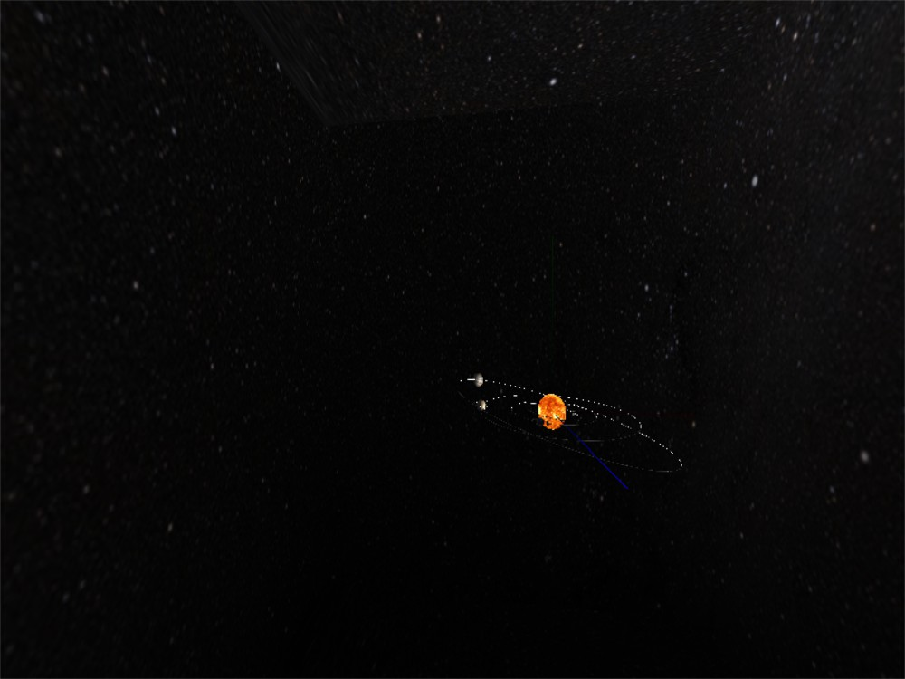

# Texture

3180102707 石昊海

## Requirements

Add textures to your solar system.
* You may use any method to generate texture coordinates
* Bonus 10%: Implement a skybox

## Install

run the .exe file in the directory, or use CMake to build target `Texture` and move the generated binaries to the root directory.

If run from the terminal, make sure to set `pwd` to where the file `README.md` is.

All those measures are there to ensure the successful loading of the texture images.

## Quick Manual

| Button                                  | Funcion                                      |
| --------------------------------------- | -------------------------------------------- |
| <kbd>w</kbd>/<kbd>s</kbd>               | move forward/ backward along z axis          |
| <kbd>a</kbd>/<kbd>d</kbd>               | move left/ right along x axis                |
| <kbd>j</kbd>/<kbd>k</kbd>               | move up/ down along y axis (inspired by Vim) |
| mouse click + horizontal/ vertical drag | rotation according to y/ x axis              |
| wheel scroll up/ down                   | zoom in / out                                |

## Description

* 太阳、行星、卫星均绑定了相应的Texture。球形天体的贴图方式为spherical projection
* 现有的天体有
  * 太阳
  * 水星
  * 地球
    * 月球
  * 木星
  * 土星
* 贴图文件在目录`./img/texture/`下。
* 实现了skybox，在下图的上方区域可以看到背景天空盒的贴图接缝。贴图方式为指定texture坐标

* 引用库[stb_image](https://github.com/nothings/stb/blob/master/stb_image.h) 实现png格式texture文件读取。
