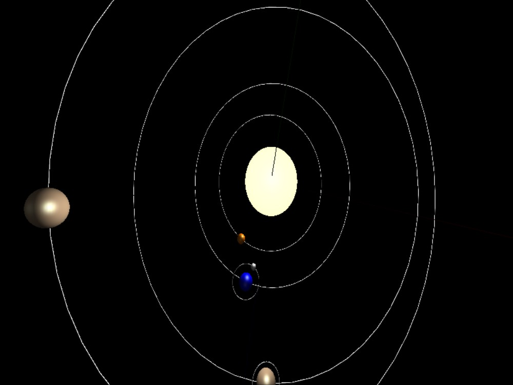

# Shading

## Requirements

* Add simple diffuse + specular (Phong or Cook-Torrance) models in your existing solar system.
* The sun is treated as a single, distant point light source

## Install

run the .exe file in the directory, or use CMake to build target `Shading`.

## Description

太阳系模型中一共添加了三个光源`GL_LIGHT0` , `GL_LIGHT1`和环境光。描述如下：

* `GL_LIGHT0`
  * 太阳发出的点光源，主要光照来源。
  * 白色
  * 相对光强1.0
* `GL_LIGHT1`
  * 辅助照明光源，为所有物体提供微弱光照
  * 从+y轴射出的平行光线
  * 白色
  * 相对光强0.1
* `AMBIENT`
  * 环境光
  * 白色
  * 相对光强0.1
